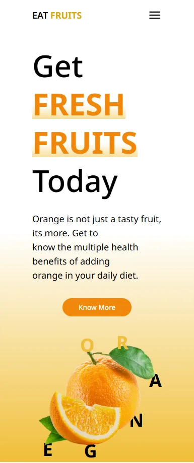

# 🍊 Fresh Fruits

A responsive website showcasing the health benefits of oranges, built with modern web technologies.




## 📑 Table of Contents
1. [✨ Features](#features)
2. [🚀 Quick Start](#quick-start)
3. [🛠 Tech Stack](#tech-stack)
4. [🎨 Design Highlights](#design-highlights)
5. [🌱 Future Improvements](#future-improvements)
6. [📊 Time Investment](#time-investment)

## Features
- Fully responsive layout (desktop/tablet/mobile)
- Dynamic navbar with mobile menu toggle
- Performance-optimized assets (lazy-loaded images)
- Smooth CSS transitions and hover effects

## Quick Start

1. Clone the repository:
   ```bash
   git clone https://github.com/your-username/fresh-fruits.git
   ```
2. Install dependencies:
    ```bash
    pnpm install
    ```
3. Start development server:
    ```bash
    pnpm dev
    ```

## Tech Stack
- ⚛️ React 19 Component-based UI
- 🎨 Tailwind CSS 4	Utility-first styling
- ⚡ Vite Fast build tool
- 🖥️ JavaScript Core functionality


## Design Highlights
- Typography: Uses font-semibold (600) and font-bold (700) weights
- Colors: Mustard (#d9a800) and orange (#F07407) accent palette
- Responsive:
- Mobile menu triggers at 850px breakpoint
- Text scales from text-6xl → text-4xl on mobile

## Future Improvements
- Add fruit nutrition calculator
- Implement dark mode toggle
- Create recipe section

## Time Investment
| Phase              | Hours |
|--------------------|-------|
| UI Design          | 4     |
| Resources & Assets | 3     |
| Responsive Fixes   | 2     |